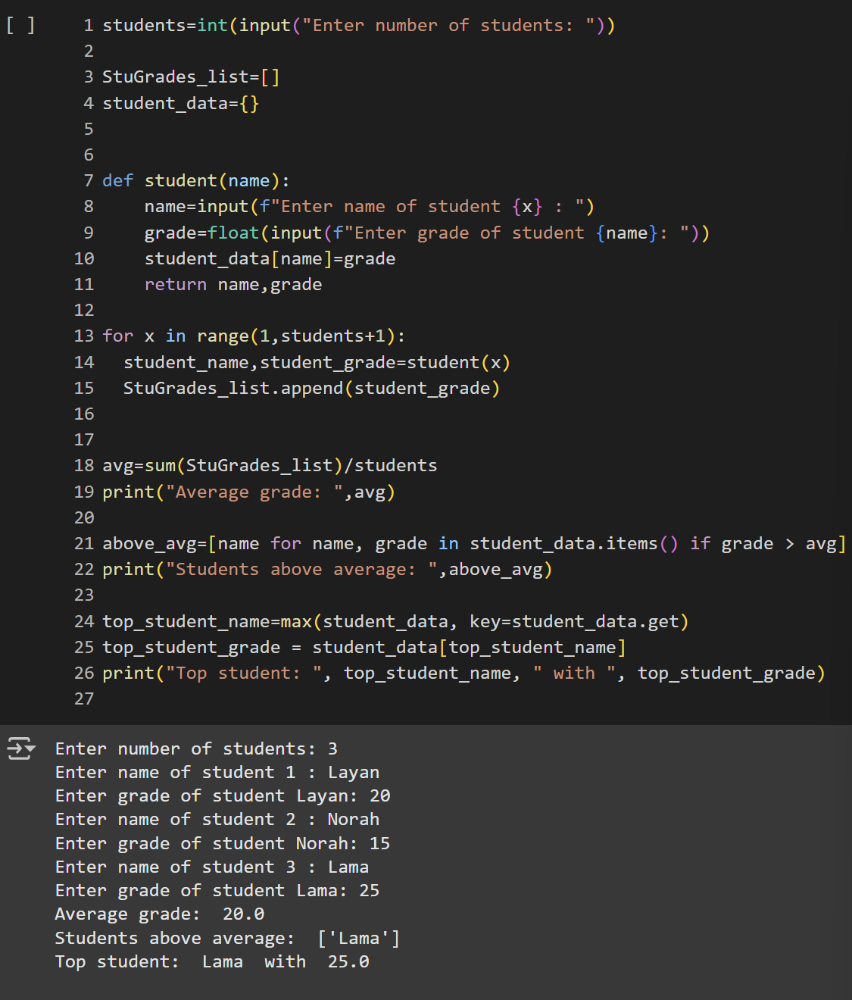

# Student Grades Analyzer

A simple Python CLI program that collects student names and grades, computes the average grade, lists students above the average, and identifies the top student.

## Features

- Prompt for number of students.
- Collect each student’s name and grade.
- Compute the average grade.
- Display the list of students who scored above the average.
- Identify and display the top-scoring student.

## Requirements

- Python 3.8 or higher

> No external dependencies are required for the basic functionality.

## Example Output

